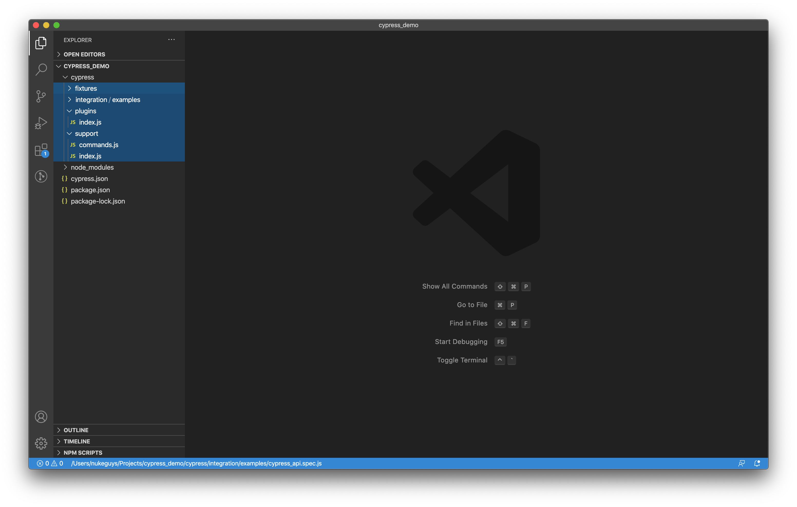
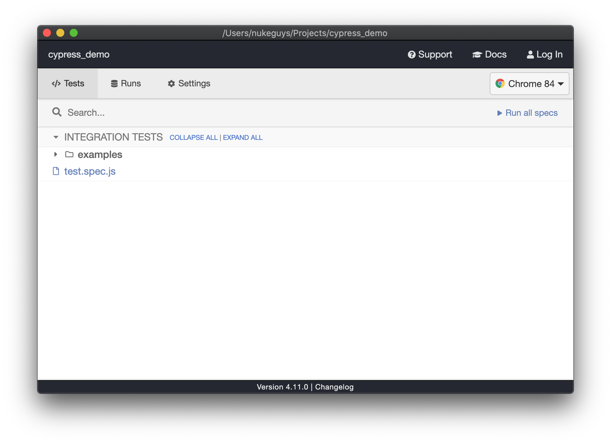
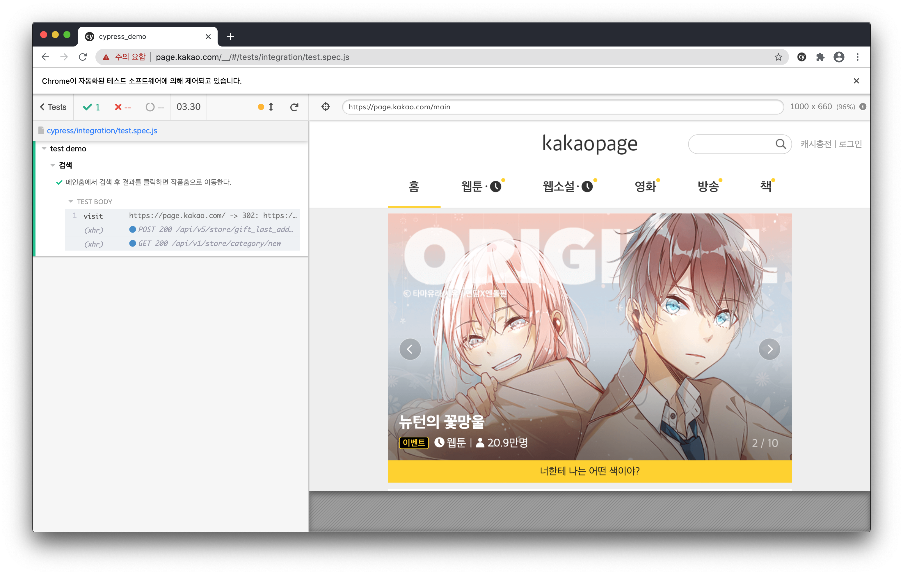
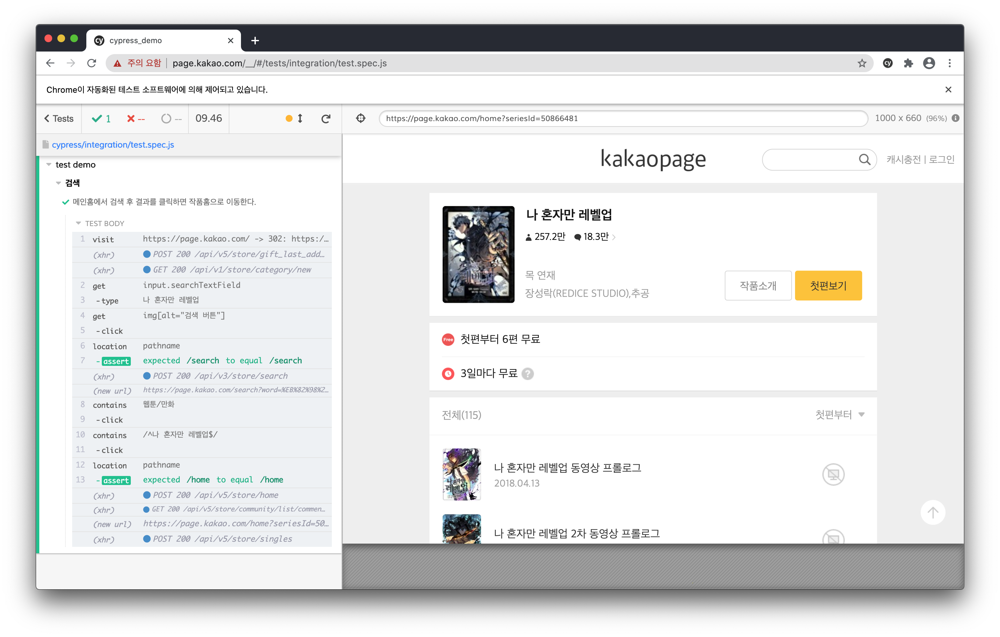

최근 프로젝트에 E2E 테스트를 위해 [cypress](https://cypress.io) 적용했다. 아직 안정화도 더 필요하고 계속 다듬어 가야 하지만, 사내에 공유하는 자리가 생겨 준비할 겸 겸사겸사 cypress 사용법을 정리해본다.

### 준비

일단 테스트를 작성한 프로젝트를 하나 준비한 다음 `cypress`를 설치 후 실행해본다. (node나 npm을 사용할 필요학 없다면 직접 바이너리를 다운받아서 사용 할 수 있다.)

```bash
# 설치
npm i --save-dev cypress
# 실행
npx cypress run
```



실행을 하게 되면 테스트코드 및 필요한 파일들이 위치할 4개의 폴더가 추가된다. cypress에서 권장하는 구조이지만 필요시 설정파일을 통해 변경할 수 있다.

**integration**: test 코드가 위치하는 곳이다. examples 폴더에 예제 파일들이 추가되어 있는데 필요시 보는 것도 많은 도움이된다.  
**fixtures**: 네트워크 응답 같은 테스트에 필요한 정적인 데이터들 만들어 둘 수 있다. `cy.fixture()` 커맨드를 통해 사용할 수 있다.  
**plugins**: 플러그인(cypress lifecycle의 특정 단계에 실행할 코드 작성, 동적으로 설정 구성 등)을 작성할 수 있다. 기본으로 `cypress/plugins/index.js`이 포함되어 있는데 각 spec 파일이 실행되기 전에 한 번 수행된다.  
**support**: plugins 처럼 `cypress/support/index.js` 파일이 각 테스트 파일 수행 전 실행된다. 주로 `custom command`나 모든 spec 파일에 적용하거나 사용할 코드를 작성한다. 예로 before나 beforeEach를 정의할 수 있다.

### 테스트

cypress는 node용 테스트 프레임워크인 [mocha](https://mochajs.org/)와 assertion 라이브러리 [chai](https://www.chaijs.com/)를 기반으로 만들어졌다. 따라서 아래처럼 테스트를 구조화 하고 작성할 때는 mocha를 따르고 assertion시에는 chai 문법을 사용 할 수 있다. (그외에도 mocking 라이브러리나 jQuery도 사용가능하다.)

```js
describe('My First Test', () => {
  it('Does not do much!', () => {
    expect(true).to.equal(true);
  });
});
```

글로벌 서비스에 적용을 했지만, 이번엔 국내 [카카오페이지 웹](https://page.kakao.com)을 대상으로 검색기능에 대한 테스트 코드를 작성하면서 기본적인 사용법을 정리해본다.

#### 테스트 정의

spec 파일(test.spec.js)을 생성 후 기본적인 커맨드들을 어느정도 사용할 수 있도록 테스트를 임의로 하나 정의했다.(추가적인 커맨드 사용을 위해 약간 불필요한 가정들을 하고 작성한 부분도 있다.)

```js
describe('cypress demo', () => {
  context('검색', () => {
    it('검색 후 결과를 클릭하면 작품홈으로 이동한다.', () => {});
  });
});
```

`describe`을 통해 테스트를 분류하고 `it`으로 실제 테스트 코드를 작성한다. `context`는 `descript`과 같은 역할을 하는데 가독성을 위해 다르게 사용했다.


cyprss를 실행해보면 작성한 spec 파일이 목록에 나오는 것을 볼 수 있다. cypress는 chromium 기반으로 실행되는데, 기본으로 electron이 포함되어 있고 설치된 브라우저가 있다면 오른쪽 목록에 표시된다. 실행시 원하는 브라우저로 변경해서 테스트 할 수 있다.

#### 테스트 코드 작성

##### 웹 사이트 방문

특정 웹 사이트에 대해 테스트를 작성하려면 기본적으로 해당 웹을 방문해야 한다. cypress에서는 `cy.visit()`을 사용한다.

```js
describe('test demo', () => {
  context('검색', () => {
    it('메인홈에서 검색 후 결과를 클릭하면 작품홈으로 이동한다.', () => {
      cy.visit('https://page.kakao.com/');
    });
  });
});
```



cypress에서 추가한 spec 파일을 클릭에서 실행해보면 정상적으로 웹에 방문한 것을 확인 할 수 있다.

한 가지 알아두어야 할 점은, 보통 unit test를 하면 given/when/then 구조로 마지막에 assertion을 하는 것으로 테스트 결과를 평가하는데, cypress의 커맨드들은 각각이 성공/실패 여부를 가질 수 있고 이에 따라 테스트 결과도 결정된다(아닌 커맨드들도 있다). 또 기본적으로 정해진 timeout동안 성공할 때 까지 retry를 한다. 즉 위의 visit도 단순히 방문하는 역할이라고 볼 수 있지만, `pageLoadTimeout`동안 해당 페이지의 `load` 이벤트를 기다린다. 만약 그 시간동안 load이벤트가 발생하지 않으면 실패가 된다.

E2E 테스트 자체가 사용자의 행위를 코드로 묘사하면서 테스트를 수행하는 BDD이기 때문에 각 행위 자체가 정상적으로 동작해야 다음 단계로 넘어간다. 따라서 어찌보면 당연하다고 볼 수 있다.

##### 검색 후 결과 클릭 및 이동 확인

최근 시즌2가 시작된 나 혼자만 레벨업 웹툰을 검색해서 테스트 해본다.

```js
describe('test demo', () => {
  context('검색', () => {
    it('메인홈에서 검색 후 결과를 클릭하면 작품홈으로 이동한다.', () => {
      const contentTitle = '나 혼자만 레벨업';

      // 방문 > 검색창 찾기 > 검색어 입력 > 검색버튼 클릭
      cy.visit('https://page.kakao.com/')
        .get('input.searchTextField')
        .type(contentTitle)
        .get('img[alt="검색 버튼"]')
        .click();

      // 검색 페이지 확인 > 웹툰/만화 탭 클릭
      cy.location('pathname').should('equal', '/search');
      cy.contains('웹툰/만화').click();

      // 결과 클릭 > 작품홈 이동 확인
      const regex = new RegExp(`^${contentTitle}$`);
      cy.contains(regex)
        .click()
        .location('pathname')
        .should('equal', '/home');
    });
  });
});
```

테스트를 위해 특정 요소를 가져오거나 조작하거나 DOM 이벤트를 처리하는 과정이 필요하다. 우선 요소를 가져올 때는 간단히 selector를 사용할 수 있다. 이 때는 `cy.get()`을 사용한다. document 전체에서 해당 요소를 가져온다. 특정 요소의 하위에서만 찾을 필요가 있으면 `cy.find()`를 사용할 수 있다.

검색을 위해서는 input에 검색어를 입력하고 검색 버튼을 클릭하는 행위가 필요하다. 이를 위해서는 각각 `type`과 `click` 커맨드를 사용한다.

클릭 후 검색결과가 표시되어야 하기 때문에 검색 페이지로 이동되었는지 확인한다. 이 때는 `location`을 사용할 수 있는데 `pathname`을 통해 간단히 확인했다.

이 후 동명의 소설도 있기 때문에 웹툰을 선택하기 위해 웹툰 탭을 선택한다. 이 때는 특정 text를 포함하고 있는 요소를 찾아서 반환해 주는 `contains`를 사용했다(단, [text를 직접 가지고 있는 요소가 아닐 수 있는 것에 주의한다.](https://docs.cypress.io/api/commands/contains.html#Preferences)). cypress에서는 가능하다면 selector를 사용하는 것보다 contains를 사용하는 것을 권장하는데 이는 DOM에 의존적이지 않고 사용자가 직접 동작하는 행위와 가깝기 때문인 듯 하다. 만약 contains를 사용하지 못하다면 `data-cy-*`와 같은 속성을 지정하고 사용하는 것도 괜찮은 방법이다.

검색결과에서에서 검색어가 포함된 요소를 가져와서 클릭 후 마찬가지로 `pathname`을 통해 페이지가 정상적으로 이동되었는지 확인한다. 이 때 정규식을 사용한 것은 검색 페이지의 안내문구에 검색어가 포함되어 있기 때문에 퍼펙트매칭을 통해 결과를 가져오기 위해서다.

최종 결과를 테스트해서 확인해 본다.



화면의 왼쪽에서 각 커맨드를 선택하면 실행되는 순간의 화면이 표시되고 콘솔에서는 커맨드의 구체적인 정보도 확인할 수 있다.

##### 개선

위의 테스트에서 몇가지를 개선해보자. 우선 검색 결과를 클릭하려면 실제로 결과가 나오는 작품이어야 한다. 나혼렙이 내려갈 일이 있을리는 없겠지만, 그래도 보다 정확한 테스트를 위해 작품을 지정하지 않고 웹에 노출되고 있는 작품을 하나 골라서 사용하도록 한다.(임의로 웹툰의 랭킹 1위 작품으로 해본다.)  
다음으로는 응답이 느린 경우를 고려해보자. 검색 버튼을 누른 후에 결과가 표시되려면 검색 api가 결과를 받아온 뒤여야 한다.(네트워크 속도를 낮추고 검색해보면 로딩 인디케이터가 표시되는 것을 볼 수 있다.) 이것도 가능성은 크지 않지만, api 응답이 timeout보다 오래 걸리는 경우라면 결과요소를 가져올 때 실패할 수 있다. 따라서 api를 기다린 후에 결과를 선택해서 클릭하도록 수정해본다.

```js
describe('test demo', () => {
  context('검색', () => {
    it('메인홈에서 검색 후 결과를 클릭하면 작품홈으로 이동한다.', () => {
      cy.visit('https://page.kakao.com/')
        .get('img[alt="웹툰/만화"]')
        .click();

      cy.contains('.rankingSection div', '1위')
        .next()
        .invoke('text')
        .then(contentTitle => {
          cy.server();
          cy.route(
            'POST',
            'https://api2-page.kakao.com/api/v3/store/search'
          ).as('api_search');

          cy.get('input.searchTextField')
            .type(contentTitle)
            .get('img[alt="검색 버튼"]')
            .click()
            .wait('@api_search');

          cy.contains('웹툰/만화').click();

          const regex = new RegExp(`^${contentTitle}$`);
          cy.contains(regex)
            .click()
            .location('pathname')
            .should('equal', '/home');
        });
    });
  });
});
```

우선 웹툰의 랭킹1위에서 title을 가져오는 부분을 보자. 요소를 선택한 다음 textContent를 가져와야 하는데, 요소에서는 jQuery의 `text()` 함수를 사용할 수 있다. 하지만 cypress 커맨드에서는 대상이 cypress 객체이기 때문에 체이닝에서 바로 사용 할 수 없고, 객체의 함수를 실행해주는 `invoke` 커맨드를 통해 처리한다.  
cypress의 테스트는 바로 실행되지 않고 전체 테스트 코드가 평가된 후에 한 번에 테스트가 진행된다. 즉 각 커맨드는 실행 할 행동을 예약하는 역할을 한다고 볼 수 있다. 따라서 아래처럼 코드를 작성하는 것은 불가능 하다.
만약 커맨드가 yield하는 값을 직접 접근하기 위해서는 위에서 처럼 `then`을 사용한다.(promise와 같다고 보면 된다.)

```js
const contentTitle = cy
  .contains('.rankingSection div', '1위')
  .next()
  .invoke('text');
cy.get('input.searchTextField').type(contentTitle);
```

cypress에서는 네트워크 요청도 컨트롤이 가능한데, 이 때 `server()`와 `route()`를 사용한다. 특정 api 요청을 발생시킬 수도 있고, 응답을 직접 지정해 줄 수도 있다. 위처럼 아무것도 없이 사용하면 해당 api응답이 발생할 때 까지 기다리는 것도 가능하다. 여기서 사용한 `as`는 alias를 지정할 수 있는 커맨드로, 사용할 때는 파라미터로 지정한 alias 앞에 `@`를 붙여서 사용한다.

##### 커스텀 커맨드

예에서는 테스트 케이스를 하나만 작성했지만, 만약 검색에 대한 테스트 케이스가 더 추가된다고 해보자. 그러면 검색 페이지로 이동하는 부분은 동일하게 필요해진다. 이렇게 특정 spec 파일에서 공통된 코드는 해당 파일에서 함수로 작성해서 공용화 하면 되는데, 다른 spec 파일에서도 필요하다면 커스텀 커맨드로 만들어 두면 유용하다.

`support/command.js`파일에 아래 코드를 추가해보자.

```js
Cypress.Commands.add('search', text => {
  cy.server();
  cy.route('POST', 'https://api2-page.kakao.com/api/v3/store/search').as(
    'api_search'
  );

  cy.get('input.searchTextField')
    .type(text)
    .get('img[alt="검색 버튼"]')
    .click()
    .wait('@api_search');
});
```

그러면 테스트 코드에서 해당 부분은 `cy.search(contentTitle)`로 간단하게 사용이 가능하다. 그리고 웹 사이트에 방문하는건 현재 spec 파일의 모든 테스트 케이스의 사전 조건이다(그렇다고 가정하자). 그럼 각 테스트 마다 추가하는 것이 아닌 `beforeEach`를 통해 각 테스트 전에 실행되어야 할 코드를 추가할 수 있다.

결과적으로는 아래처럼 테스트 코드를 작성할 수 있다.

```js
describe('test demo', () => {
  context('검색', () => {
    beforeEach(() => {
      cy.visit('https://page.kakao.com/');
    });

    it('메인홈에서 검색 후 결과를 클릭하면 작품홈으로 이동한다.', () => {
      cy.get('img[alt="웹툰/만화"]').click();

      cy.contains('.rankingSection div', '1위')
        .next()
        .invoke('text')
        .then(contentTitle => {
          cy.search(contentTitle);
          cy.contains('웹툰/만화').click();

          const regex = new RegExp(`^${contentTitle}$`);
          cy.contains(regex)
            .click()
            .location('pathname')
            .should('equal', '/home');
        });
    });
  });
});
```

최대한 커맨드들을 많이 사용해 보기 위해 테스트를 약간 인위적으로 처리한 부분도 있긴 하지만, 덕분에 기본적으로 필요한 것들은 대부분 포함이 된 것 같다. 이정도만 알아도 나머지는 알아가면서 충분히 테스트를 작성할 수 있을 거라고 본다.

### 주의할 점

cypress를 실제 프로젝트에 적용하면서 까다로웠던 부분이다.

우선 요소를 가져오는 방법이다. contains를 사용하면 좋다고 했지만 실제로는 사용하지 못하는 경우들이 많았다. data 속성이나 alt가 있는 이미지라면 다행이지만 그렇지 않은 경우에는 대부분 selector를 사용해야 했는데, 최대한 DOM구조에 의존적이지 않도록 하면서 selector를 작성하는게 생각만큼 쉽지 않았다. 테스트를 할 계획이라면 미리 고려해서 구현하는 것도 좋을 듯 하다.

두 번째는 api와 같은 비동기 처리다. 위에서도 언급했지만 특정 api가 수행된 이후에 표시되는 화면 요소들은 직접 구현된 코드를 보지 않으면 알기가 어렵다. 더구나 보통의 경우에는 문제 없이 테스트가 통과하기 때문에 여러번 반복해서 테스트를 실행해야 에러가 발생한다. 물론 응답 속도 자체도 테스트의 일부에 포함시켜 실패로 간주할 수 있지만, 그렇지 않다면 코드를 일일이 확인하거나 반복하는 수밖에 없다.

마지막으로는 아무래도 유저 행동을 테스트하는 부분이다 보니 조건부 테스트가 필요한 곳들이 생긴다. 즉 유저의 현재 상태에 따라 테스트가 진행되어야 하는데 그런 상황을 코드로 모두 만들어 내는 것이 쉽지 않은 경우들이 있다. 그래서 원하는 테스트를 만들 수 없는 경우도 있고, 미리 조건을 만들어 놓고 테스트를 해야만 하는 경우도 있는데 실 서비스 환경에서 처리해야 하기 때문에 이것도 간단하지는 않을 수 있다.

적용이 어려운 부분들이 조금 있고 아쉬운 부분들도 있긴 하지만, 모니터링 목적으로 주기적으로 CI에서 돌리고 있고 그 와중에 실제 문제들도 잡아서 제 역할도 나름 하고 있다. 완벽하지는 않아도 일단 간단하게 나마 적용해보는 것도 나쁘진 않을 것 같다.
