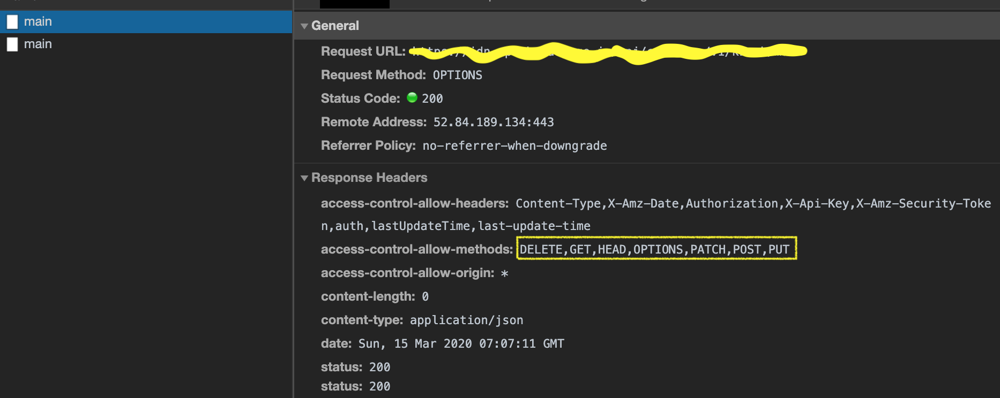

웹 개발을 하다 보면 네트워크 요청시 실제 원하는 요청(GET, PUT, POST, DELETE 등)전에 `OPTIONS` 요청이 발생하는 것을 볼 수 있다. 이게 뭘까하고 응답값을 확인하면 아무것도 없다. 응답값이 없는 이 요청은 왜 발생하는걸까?
 `preflight`라고도 불리는 `OPTIONS` 요청은 브라우저가 서버에게 지원하는 옵션들을 미리 요청하고 허가된 요청에 한해서 전송하기 위한 보안상의 목적이 있다.  
 모든 경우에 발생하지 않고, 실제 요청에 비해 많은 부분을 차지하지 않지만 경우에 따라 수백 ms 응답 속도가 중요하다면 발생하지 않도록 하는 것이 좋다. 그러기 위해선 발생하는 상황을 알아야 하는데 이는 `CORS`와 관련이 있다.

##### CORS(Cross-Origin Resource Sharing)와 보안

웹 개발을 하는 사람이라면 대부분 알겠지만 간단히 정리하면, 현재 웹페이지가 웹페이지를 받은 서버와 다른 서버의 리소스를 요청하는 것을 의미한다. 대표적인 예로 웹서버와 분리되어 있는 API 서버로 요청을 보내거나, 아래처럼 CDN의 이미지를 사용하는 것을 들 수 있다.
```html
/image.png'>
```
하지만 이는 유용하면서도 보안상의 문제점을 가지고 있다. 웹사이트에서 악의적인 목적으로 외부로 정보를 보내거나 하는 등의 요청을 보낼 수 있기 때문이다. 그렇기 때문에 브라우저는 `OPTIONS`를 `preflight`하여 서버에서 허용하는 옵션을 미리 확인하고, 허용되지 않은 요청의 경우 `405(Method Not Allowed)`에러를 발생시키고 실제 요청은 전송하지 않는다.

##### OPTIONS 요청
하지만 모든 CORS 상황에서 `OPTIONS` 요청이 발생하지 않는다. 아래 조건을 모두 만족하면 OPTIONS 없이 요청을 보낸다.
1. `GET`, `HEAD`, `POST` 요청 중 하나
2. user agent에 의해 자동으로 설정되는(Connection, User-Agent, Fetch 스펙상 [forbidden header](https://fetch.spec.whatwg.org/#forbidden-header-name)로 정의되어 있는) 헤더외에 [CORS-safelisted request-header](https://fetch.spec.whatwg.org/#cors-safelisted-request-header)로 명시된 헤더들만 포함된 경우(`Accept`, `Accept-Language`, `Content-Language`, `Content-Type` 등)
3. Content-Type은 `application/x-www-form-urlencoded`,
`multipart/form-data`, `text/plain`만 허용

위의 조건들 중 하나라도 만족하지 않으면 preflight 요청을 보내게 된다. 이 과정을 간단히 정리하면 아래와 같다.
1. 브라우저에서 method를 `OPTIONS`로 요청 전송
2. OPTIONS를 받은 서버가 응답헤더에 허용하는 옵션(`Access-Control-Allow-*`)을 포함해 전송
3. 브라우저는 응답헤더의 옵션을 확인해 허용되지 않은 요청은 `504`에러 발생, 허용하는 경우 요청 전송



참고로 CORS가 가능하려면 서버에서 허용된 origin이어야 한다. 서버에서 응답을 보낼 때 헤더에 `Access-Control-Allow-Origin`을 포함해 함께 보내는데 이 값에 `origin`이 포함되지 않는다면 에러가 발생하게 된다. 일반적으로 말하는 CORS 문제이다.

##### OPTIONS 요청 없애기
첫 번째는 CORS 상황이 되지 않도록 하는 것이다. 즉 웹서버와 동일한 서버의 리소스만 사용하는 것이다. 하지만 API 서버가 분리되어 있는 경우가 많기 때문에 쉽지 않다. 이런 경우에는 웹에서 발생하는 요청을 웹서버와 동일한 서버에서 받아 실제 API서버로 전달하는 중계점을 두면 해결될 수 있다.

두 번째로는 CORS에서 preflight가 발생하지 않는 조건을 모두 만족시키는 것이다. 하지만 이것도 일반적으로 인증을 위한 헤더를 포함하거나, 최근엔 Content-Type으로 `application/json`을 사용하는 경우가 많기 때문에 적용하기는 어려울 수 있다.

##### 사족
관련 정보를 찾아보다가 네트워크 요청을 위한 라이브러리(axios 같은)를 사용하면서 OPTIONS 요청이 발생한다고 문제를 제기하는 경우들 봤는데 이는 http와 관련된 웹 표준이기 때문에 해당 라이브러리들에서는 어찌할 도리가 없다.

추가로, 내용과는 조금 거리가 있지만 예전부터 요청과 응답을 통제하기 위해 표준에 정의된 헤더나 상태코드를 활용하는 경우를 많지 보지 못했다. 물론 장단점이 있겠지만 좀 더 잘 알고 사용해보면 좋지 않을까 하는 생각이 다시 한 번 들었다.

[참고] - [교차 출처 리소스 공유 (CORS) - HTTP \| MDN](https://developer.mozilla.org/ko/docs/Web/HTTP/CORS)